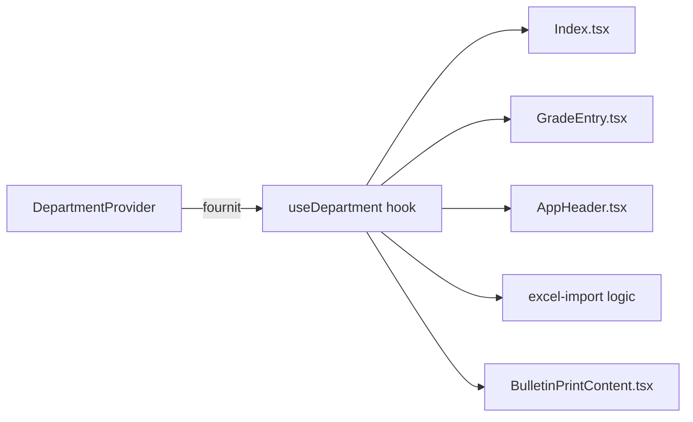
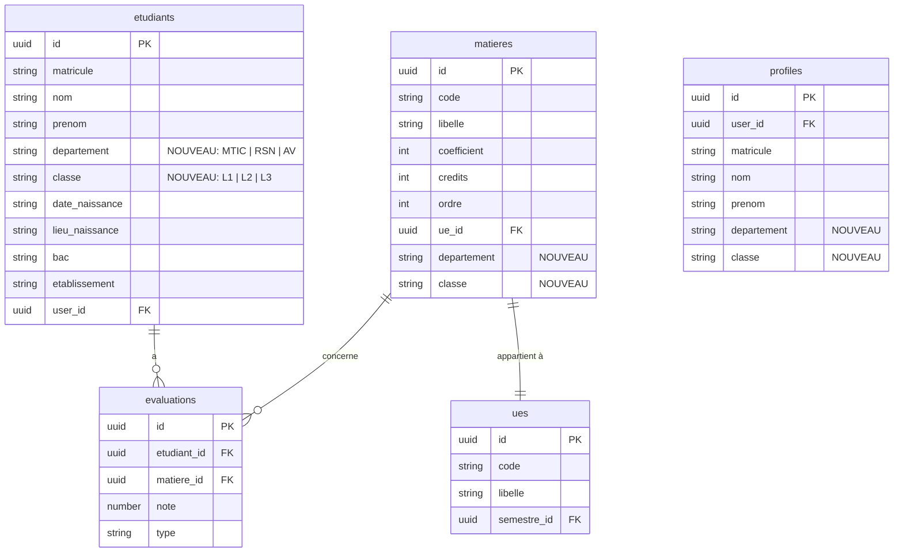

# Document de Conception Technique — Gestion Universitaire Multi-Départements

## Overview

L'application INPTIC Grade Manager est actuellement dédiée à une seule filière (LP ASUR — RSN, L3). Cette fonctionnalité étend le système pour prendre en charge neuf groupes distincts répartis sur trois départements (MTIC, RSN, AV) et trois niveaux (L1, L2, L3) chacun.

### Objectifs principaux

- Introduire une dimension **département + classe** dans toutes les entités du domaine (étudiants, matières, évaluations).
- Offrir un sélecteur de navigation permettant de basculer entre les neuf combinaisons sans rechargement de page.
- Garantir que **toutes** les opérations (affichage, saisie, import, export, bulletins, statistiques) sont rigoureusement filtrées par la sélection courante.
- Permettre à l'espace étudiant d'afficher uniquement les données propres au département et à la classe de l'étudiant connecté.

### Contraintes techniques

- Stack existante conservée : **React 18 + TypeScript + Vite + Supabase + Tailwind CSS + shadcn/ui**.
- Aucune migration destructive : les données RSN L3 existantes sont conservées et simplement taggées avec le nouveau contexte.
- Les matières restent définies de façon statique dans `src/data/subjects.ts` (par département et classe) plutôt que dans la base, pour éviter la complexité de gestion dynamique des programmes.
- L'état de la sélection courante est global (React context) pour persister entre les onglets.

---

## Architecture

### Diagramme de flux principal

```mermaid
flowchart TD
    A[Utilisateur Admin] --> B[Sélecteur Département/Classe]
    B --> C{Sélection valide?}
    C -- Non --> D[Indicateur "Sélectionner d'abord"]
    C -- Oui --> E[DepartmentContext mis à jour]
    E --> F[Tableau de bord — étudiants filtrés]
    E --> G[Saisie des notes — matières filtrées]
    E --> H[Import Excel — tag dept/classe appliqué]
    E --> I[Export ZIP — bulletins filtrés]
    F --> J[Bulletin — en-tête avec dept/classe]
    G --> J
```

### Diagramme de l'état global



### Stratégie de migration Supabase

La migration ajoute deux colonnes `departement` et `classe` aux tables `etudiants` et `matieres`, ainsi qu'une nouvelle table `departements_config` (optionnelle, pour les métadonnées futures). Les données RSN L3 existantes sont automatiquement migrées avec `departement = 'RSN'` et `classe = 'L3'`.



---

## Components and Interfaces

### Nouveaux types TypeScript

**`src/types/university.ts`** (nouveau fichier)

```typescript
export const DEPARTEMENTS = ['MTIC', 'RSN', 'AV'] as const;
export type Departement = typeof DEPARTEMENTS[number];

export const CLASSES = ['L1', 'L2', 'L3'] as const;
export type Classe = typeof CLASSES[number];

export type DepartementClasse = {
  departement: Departement;
  classe: Classe;
};

// Labels lisibles pour l'UI
export const DEPARTEMENT_LABELS: Record<Departement, string> = {
  MTIC: 'Management des TIC',
  RSN: 'Réseaux et Systèmes Numériques',
  AV: 'Audio-visuel',
};
```

### Contexte global de sélection

**`src/contexts/DepartmentContext.tsx`** (nouveau fichier)

```typescript
interface DepartmentContextValue {
  departement: Departement | null;
  classe: Classe | null;
  setSelection: (dept: Departement, cls: Classe) => void;
  clearSelection: () => void;
  isSelected: boolean; // true si les deux sont définis
}
```

Ce contexte :
- Persiste la sélection dans `sessionStorage` pour survivre aux rechargements.
- Expose `isSelected` pour bloquer les actions sensibles (import, export) lorsqu'aucune combinaison n'est choisie.
- Est fourni au niveau `App.tsx` à l'intérieur de `AuthProvider`.

### Composant `DepartmentSelector`

**`src/components/DepartmentSelector.tsx`** (nouveau)

Composant de navigation affiché dans `AppHeader` ou dans la barre d'outils principale de la page admin. Contient :
- Un `Select` pour le département (3 options).
- Un `Select` pour la classe (3 options, activé seulement après sélection du département).
- Déclenche `setSelection` du contexte à chaque changement.

```
┌─────────────────────────────────────────────────────────────┐
│  Département : [Réseaux et Systèmes Numériques ▼]           │
│  Classe      : [L3 ▼]                                       │
└─────────────────────────────────────────────────────────────┘
```

### Modifications des composants existants

| Composant | Modification |
|---|---|
| `AppHeader.tsx` | Intègre le badge de sélection courante et `DepartmentSelector` |
| `Index.tsx` | Consomme `useDepartment()` pour filtrer `students` et bloquer import/export si pas de sélection |
| `GradeEntry.tsx` | Filtre les matières affichées selon la sélection |
| `GradesTable.tsx` | Reçoit uniquement les étudiants déjà filtrés (pas de changement interne) |
| `BulletinPrintContent.tsx` | Reçoit `departement` et `classe` pour les afficher dans l'en-tête |
| `BulletinModal.tsx` | Transmet `departement` et `classe` à `BulletinPrintContent` |
| `StudentSpace.tsx` | Lit `departement` et `classe` depuis le profil étudiant pour filtrer les matières |

### Hooks modifiés / créés

| Hook | Rôle |
|---|---|
| `useDepartment()` | Consomme `DepartmentContext` |
| `useStudents(dept, classe)` | Ajoute les paramètres de filtre ; appelle `fetchStudents(dept, classe)` |
| `useSubjects(dept, classe)` | Nouveau — retourne les matières de la combinaison sélectionnée |

### Edge Functions Supabase

**`supabase/functions/import-students`** (modification) : accepte deux nouveaux champs `departement` et `classe` dans le payload. Tous les étudiants du lot sont enregistrés avec ces valeurs. La logique upsert preserve `departement` et `classe` des étudiants existants (ne les écrase pas).

---

## Data Models

### Extension de `Student`

Le type `Student` dans `src/data/students.ts` est étendu :

```typescript
export type Student = {
  matricule: string;
  nom: string;
  prenom: string;
  departement: Departement;   // NOUVEAU — obligatoire
  classe: Classe;             // NOUVEAU — obligatoire
  dateNaissance?: string | null;
  lieuNaissance?: string | null;
  bac?: string | null;
  etablissement?: string | null;
  s5: S5Grades;
  s6: S6Grades;
  moyenneGenerale: number;
};
```

### Matières par département et classe

Le fichier `src/data/subjects.ts` (nouveau) remplace les constantes `S5_SUBJECTS` / `S6_SUBJECTS` monolithiques par une structure indexée :

```typescript
export type SubjectDef = {
  key: string;
  label: string;
  credits: number;
  coef: number;
  ue: string;
  semestre: 'S1' | 'S2' | 'S3' | 'S4' | 'S5' | 'S6';
};

export type SubjectsMap = {
  [dept in Departement]: {
    [cls in Classe]: SubjectDef[];
  };
};

export const SUBJECTS: SubjectsMap = {
  RSN: {
    L1: [...],
    L2: [...],
    L3: [/* mêmes matières S5/S6 qu'actuellement */],
  },
  MTIC: {
    L1: [...],
    L2: [...],
    L3: [...],
  },
  AV: {
    L1: [...],
    L2: [...],
    L3: [...],
  },
};

export const getSubjects = (dept: Departement, cls: Classe): SubjectDef[] =>
  SUBJECTS[dept]?.[cls] ?? [];
```

### `AuthUser` étendu

```typescript
export type AuthUser = {
  email: string;
  role: 'admin' | 'student';
  displayName: string;
  userId: string;
  matricule?: string;
  departement?: Departement;  // NOUVEAU — renseigné pour les étudiants
  classe?: Classe;            // NOUVEAU — renseigné pour les étudiants
};
```

### SQL de migration

```sql
-- Migration 001_add_dept_classe.sql

ALTER TABLE etudiants
  ADD COLUMN IF NOT EXISTS departement TEXT NOT NULL DEFAULT 'RSN'
    CHECK (departement IN ('MTIC', 'RSN', 'AV')),
  ADD COLUMN IF NOT EXISTS classe TEXT NOT NULL DEFAULT 'L3'
    CHECK (classe IN ('L1', 'L2', 'L3'));

ALTER TABLE matieres
  ADD COLUMN IF NOT EXISTS departement TEXT DEFAULT 'RSN'
    CHECK (departement IN ('MTIC', 'RSN', 'AV')),
  ADD COLUMN IF NOT EXISTS classe TEXT DEFAULT 'L3'
    CHECK (classe IN ('L1', 'L2', 'L3'));

ALTER TABLE profiles
  ADD COLUMN IF NOT EXISTS departement TEXT
    CHECK (departement IN ('MTIC', 'RSN', 'AV')),
  ADD COLUMN IF NOT EXISTS classe TEXT
    CHECK (classe IN ('L1', 'L2', 'L3'));

-- Index de performance pour les requêtes filtrées
CREATE INDEX IF NOT EXISTS idx_etudiants_dept_classe
  ON etudiants (departement, classe);
CREATE INDEX IF NOT EXISTS idx_matieres_dept_classe
  ON matieres (departement, classe);
```

### Requêtes Supabase modifiées

`fetchStudents` accepte désormais un filtre optionnel :

```typescript
export const fetchStudents = async (
  departement?: Departement,
  classe?: Classe
): Promise<Student[]> => {
  let query = supabase
    .from('etudiants')
    .select('id, matricule, nom, prenom, departement, classe, ...')
    .order('matricule');

  if (departement) query = query.eq('departement', departement);
  if (classe) query = query.eq('classe', classe);
  // ...
};
```

---

## Correctness Properties

*Une propriété est une caractéristique ou un comportement qui doit être vérifié pour toutes les exécutions valides d'un système — c'est une déclaration formelle sur ce que le logiciel est censé faire. Les propriétés servent de pont entre les spécifications lisibles par un humain et les garanties de correction vérifiables automatiquement.*

### Property 1: Invariant structurel des entités

*Pour tout* enregistrement étudiant ou matière créé ou importé dans le système, les champs `departement` et `classe` doivent appartenir respectivement aux ensembles `{'MTIC', 'RSN', 'AV'}` et `{'L1', 'L2', 'L3'}`, et ne peuvent pas être nuls.

**Validates: Requirements 1.1, 1.2, 1.3**

---

### Property 2: Rejet des créations invalides

*Pour tout* objet étudiant dont le champ `departement` ou `classe` est absent, nul, ou ne fait pas partie des valeurs autorisées, la tentative de création doit échouer avec un message d'erreur descriptif, sans modifier l'état du système.

**Validates: Requirements 1.4, 1.5**

---

### Property 3: Filtrage correct par département et classe

*Pour toute* liste d'étudiants contenant des enregistrements de départements et classes variés, et pour toute combinaison `(dept, classe)` valide, la fonction `filterStudents(students, dept, classe)` doit retourner exactement les étudiants satisfaisant `student.departement === dept && student.classe === classe` — ni plus, ni moins.

**Validates: Requirements 2.3, 3.1, 3.3, 5.2, 5.3, 6.2**

---

### Property 4: Persistance de la sélection entre les modes

*Pour toute* sélection `(dept, classe)` active, le basculement entre les modes "Tableau de bord" et "Saisie des notes" ne doit pas modifier la sélection courante — les deux valeurs restent identiques avant et après le changement de mode.

**Validates: Requirements 2.4**

---

### Property 5: Isolation des statistiques par groupe

*Pour toute* liste d'étudiants et toute sélection `(dept, classe)`, les statistiques calculées (effectif, moyenne de promotion, nombre d'admis) sur la liste filtrée doivent être identiques aux statistiques calculées si la liste d'entrée ne contenait que des étudiants de ce département et cette classe. Autrement dit, la présence d'étudiants d'autres groupes dans la liste source ne doit jamais influencer les statistiques affichées.

**Validates: Requirements 3.2**

---

### Property 6: Contenu du bulletin — présence du département et de la classe

*Pour tout* étudiant ayant un `departement` et une `classe` définis, le document de bulletin généré (rendu HTML ou PDF) doit contenir le nom complet du département (ex. « Réseaux et Systèmes Numériques ») et la classe (ex. « L3 ») dans son en-tête.

**Validates: Requirements 3.4, 6.3**

---

### Property 7: Attribution correcte lors de l'import

*Pour tout* lot d'import Excel déclenché avec une sélection `(dept, classe)` active, chaque étudiant créé par cet import doit avoir `departement === dept` et `classe === classe`. L'attribution dépend exclusivement de la sélection au moment de l'import, pas du contenu du fichier.

**Validates: Requirements 4.1**

---

### Property 8: Préservation du département/classe lors d'un upsert

*Pour tout* étudiant déjà enregistré avec un `departement` et une `classe` donnés, un import ultérieur contenant le même matricule doit mettre à jour les données personnelles et les notes, mais les valeurs de `departement` et `classe` dans la base de données doivent rester inchangées.

**Validates: Requirements 4.3**

---

### Property 9: Import partiel — seules les lignes valides sont insérées

*Pour tout* fichier Excel contenant un mélange de lignes valides (matricule présent, notes dans [0, 20]) et de lignes invalides, le résultat de l'import doit contenir exactement les lignes valides et aucune ligne invalide. L'ajout d'une ligne invalide supplémentaire dans le fichier ne doit pas affecter les lignes valides déjà importées.

**Validates: Requirements 4.4**

---

### Property 10: Indépendance des configurations de matières

*Pour toutes* deux paires `(dept1, cls1)` et `(dept2, cls2)` distinctes, la modification des paramètres d'une matière (coefficient, crédits) dans le premier groupe ne doit avoir aucun effet sur les paramètres du second groupe.

**Validates: Requirements 5.4**

---

### Property 11: Cohérence du profil étudiant et du contexte de navigation

*Pour tout* étudiant connecté avec un profil ayant un `departement` et une `classe` définis, les données chargées par `buildAuthUser` et exposées via `useAuth()` doivent avoir `departement` et `classe` identiques aux valeurs stockées dans la table `etudiants` pour ce `user_id`.

**Validates: Requirements 6.1**

---

### Property 12: Affichage de la sélection courante dans l'en-tête

*Pour toute* combinaison `(dept, classe)` valide sélectionnée, le composant d'en-tête doit afficher le label complet du département et le code de la classe. Si la sélection change pour une autre combinaison valide, l'affichage doit être mis à jour pour refléter la nouvelle sélection.

**Validates: Requirements 7.1**

---

## Error Handling

### Validation des données côté client

| Situation | Comportement attendu |
|---|---|
| Import déclenché sans sélection dept/classe | Toast d'avertissement, upload bloqué |
| Création d'étudiant sans dept/classe | Formulaire invalide, message sur les champs manquants |
| Note hors de la plage [0, 20] dans Excel | Ligne signalée dans les warnings, ligne ignorée |
| Colonne obligatoire manquante (matricule) | Ligne ignorée avec warning explicite |

### Validation côté Supabase (DB constraints)

- Contraintes `CHECK` sur `departement` et `classe` dans les tables `etudiants`, `matieres`, `profiles`.
- L'Edge Function `import-students` renvoie un tableau `errors[]` détaillant les lignes rejetées.
- Les règles RLS (Row Level Security) existantes ne sont pas modifiées ; elles continuent de s'appliquer par `user_id`.

### Gestion des états vides

- Si aucun étudiant n'est enregistré pour la combinaison sélectionnée → message « Aucun étudiant enregistré pour [Département] — [Classe]. Importez un fichier Excel pour commencer. »
- Si un étudiant connecté n'a pas de `departement` ou `classe` → message « Votre profil n'est pas encore associé à une filière. Contactez l'administration. »
- Si aucune sélection n'est active dans l'interface admin → indicateur visuel dans l'en-tête bloquant toutes les actions de modification.

### Transitions d'état et cohérence

Lorsque l'utilisateur change de département ou de classe :
1. `DepartmentContext` met à jour la sélection.
2. `useStudents` et `useSubjects` déclenchent un rechargement Supabase avec les nouveaux filtres.
3. L'UI affiche un état de chargement (`Loader2`) pendant la transition.
4. En cas d'erreur réseau, le message d'erreur existant s'affiche et la sélection précédente est préservée.

---

## Testing Strategy

### Tests unitaires (exemples et cas limites)

- **Filtrage** : `filterStudents` retourne un tableau vide pour une sélection sans correspondance.
- **Sélecteur** : `DepartmentSelector` rend 3 options de département ; après sélection d'un département, 3 options de classe sont disponibles.
- **État vide** : le tableau de bord affiche le message approprié quand `filtered.length === 0`.
- **Import bloqué** : tenter un import sans sélection déclenche le toast de blocage.
- **Étudiant sans profil** : `StudentSpace` affiche le message de contact administration.

### Tests de propriétés (property-based testing)

La librairie retenue est **[fast-check](https://fast-check.dev/)** (TypeScript natif, intégration Vitest). Chaque propriété est exécutée avec un minimum de **100 itérations**.

Configuration de tag pour chaque test :
```
// Feature: university-management, Property N: <texte de la propriété>
```

**Propriété 1** — Invariant structurel des entités
```typescript
fc.property(
  fc.record({ departement: fc.constantFrom(...DEPARTEMENTS), classe: fc.constantFrom(...CLASSES), ... }),
  (student) => isValidStudent(student) === true
)
```

**Propriété 2** — Rejet des créations invalides
```typescript
fc.property(
  fc.record({ departement: fc.option(fc.string()), classe: fc.option(fc.string()), ... })
    .filter(s => !DEPARTEMENTS.includes(s.departement) || !CLASSES.includes(s.classe)),
  (invalidStudent) => validateStudent(invalidStudent).isValid === false
)
```

**Propriété 3** — Filtrage correct
```typescript
fc.property(
  fc.array(studentArbitrary),
  fc.constantFrom(...DEPARTEMENTS),
  fc.constantFrom(...CLASSES),
  (students, dept, cls) => {
    const result = filterStudents(students, dept, cls);
    return result.every(s => s.departement === dept && s.classe === cls) &&
           students.filter(s => s.departement === dept && s.classe === cls).length === result.length;
  }
)
```

**Propriétés 4, 5, 6, 7, 8, 9, 10, 11, 12** — Suivent le même patron avec les arbitraires adaptés (étudiants, lots d'import, états de contexte).

### Tests d'intégration

- **Import Excel → Supabase** : tester avec 2-3 fichiers représentatifs que les étudiants sont bien enregistrés avec le bon `departement` et `classe`.
- **Export ZIP** : vérifier que le ZIP généré contient un dossier par semestre et que les fichiers correspondent aux étudiants du groupe sélectionné.
- **Espace étudiant** : vérifier que le login d'un étudiant RSN L3 charge bien les matières RSN L3 et non celles d'un autre groupe.

### Approche complémentaire

Les tests unitaires couvrent les cas concrets et les cas limites ; les tests de propriétés vérifient la correction universelle sur des données générées. Ensemble, ils garantissent une couverture complète des exigences fonctionnelles sans redondance.
